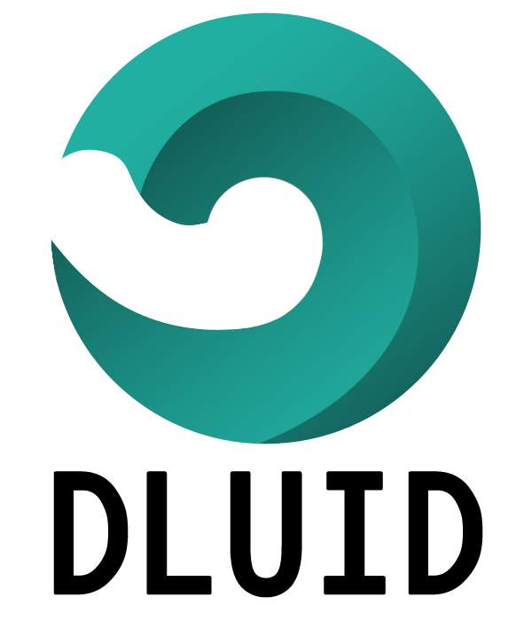

## Introduction
DLUID (Deep Learning User Interface Design)  
Dluid is a learning application for non-specialists in the computer programming but who want to study deep learning.  

- No complex package installation required.
- No require programming knowledge.
- Easy create a sequence model and test it.
- You can use excel or csv data set.

## Demonstration

  

Iris problem
  

  
  

  

Mnist problem
  

## Motivation
Many people compare the process of making models using deep learning to Lego.
But why don't we have tools like Lego for deep learning?

Let me give you an example.
There is a business student 'Raynor' who wants to study deep learning because it's so hot.
He wants to know how deep learning can be used in future management issues.
Full of enthusiasm, he took a lecture about deep learning. 
Now, it's time to practice.
But unfortunately, he doesn't have experience about programming languages.
Can this student complete the studying about deep learning safely?

As you know, generally when you study deep learning, it has same mean that studying tensorflow.
Yeah, We know tensorflow is a great library.
But no matter how cool the tensorflow is, It's a difficult library to learn for non-developers.
Because even developers have to spend their time for studying it.
Do you really think non developer like raynor easily learns about such a library?
'from', 'in', 'for', 'if' ... Even simple grammar is obstacle for them.
The code is messy and he has no idea how to organize it.
He just wanted to study deep learning, but he spends a whole night fixing Python grammar errors.
And even he has to install a tensorflow library using a tool called a "pip" that he can't guess what abbreviation is.
And more, if his OS is Windows, he needs to install 'conda' and create a 'virtual environment'!

Maybe these people might give up deep learning before start studying it.
They feel deep learning like a more darker black box.
And for them, it seems like artificial intelligence will take away all the jobs and dominate the world after overwhelming the humans.
We need to at least get out of this fiction.
So I thought it would be nice to have a GUI tool for studying deep learning.
Dluid is a studying tool that provides a simple hands-on experience for these people.

For someone who want to study deep learning. try this application with below recommend lecture.  
[Lecture 1 (English)](https://www.youtube.com/watch?v=SKq-pmkekTk&list=PLlMkM4tgfjnJ3I-dbhO9JTw7gNty6o_2m&index=2&t=0s)  
[Lecture 2 (Korean)](https://www.youtube.com/watch?v=BS6O0zOGX4E&list=PLlMkM4tgfjnLSOjrEJN31gZATbcj_MpUm)

## Version
#### v0.1.0 (2020.02.01)  
- [Download executable file](https://github.com/kok202/Dluid/releases/download/v0.1.0/Executable.file.zip) 
- [Download sample data set](https://github.com/kok202/Dluid/releases/download/v0.1.0/Sample.data.set.zip)
- Main feature
  - Support layer
    - Input
    - Output
    - FCNN
    - CNN 1D
    - CNN 2D
    - DeCNN 2D
    - RNN
    - LSTM
    - RNN Output
    - Reshape
    - Pooling 1D
    - Pooling 2D
    - Batch norm
  - Easily create sequence model and test it.
    - Excel, csv data load
    - Visualize learning curve
    - Confirm test data set
    - Confirm test result and export it  
  
## Comment
- Double click block : connection start.

## TODO 
- Check training RNN correctly. (bug(?)).
- Save and load model.
- Save model as python or dl4j code.
- Develop merge and switch layer. Goal : create several model and train them while finding interaction. 
- Extend project to application that can make MNIST VAE or GAN.
