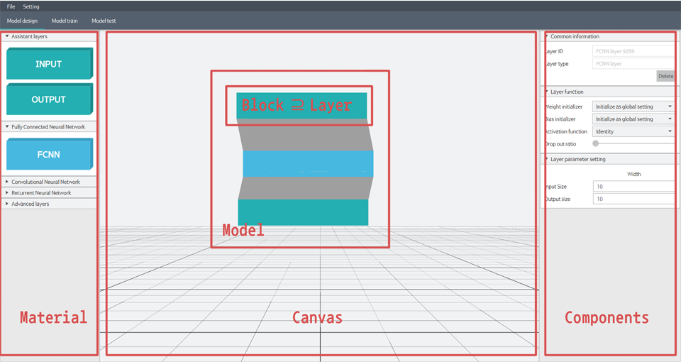

## Frame

Dluid is composed of frames that are outlined above. 
Material is object which is not block but can be a block. 
And block is the hexagon, which actually becomes a 3D polygon in the Canvas component,
The block also has information about layers used in deep learning. 
Components mean each panel which is designed to read and modify the deep learning layer. 
The term `component` is frequently used in javafx and elsewhere, so be careful not to be confused.

###  Materials
Material is object which is not block but can be a block. 
Basically, Dluid process a few steps to add layers to the AI model.
1. User selects `material` and puts it in to the canvas.
1. The material on the canvas becomes a `block`.
1. `block` has dluid `layer`. 
1. When an AI model is initialized, the block becomes a `layer`.

Dluid support below materials.
  - Input
  - Output
  - FCNN
  - CNN 1D
  - CNN 2D
  - DeCNN 2D
  - RNN
  - LSTM
  - RNN Output
  - Reshape
  - Pooling 1D
  - Pooling 2D
  - Batch norm

Users can design models using materials.
Material has minimum data for representing the type of `block`.

### Components 
Component is panel for showing the AI layer status.
For example you can see the layer input and out size through the component.
As well as size of layer, there is some information to show user.
Layer can have several component.
And each component is grouped by the type of information.
