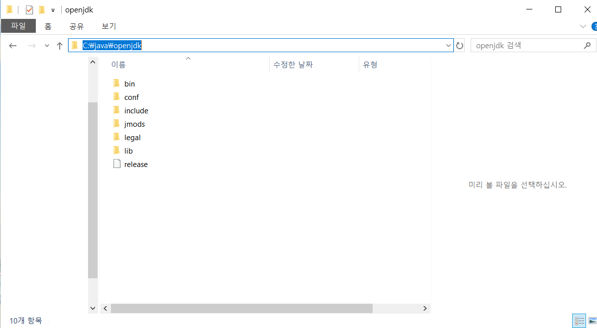
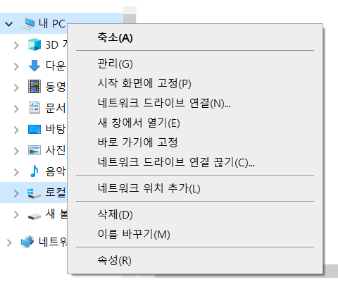
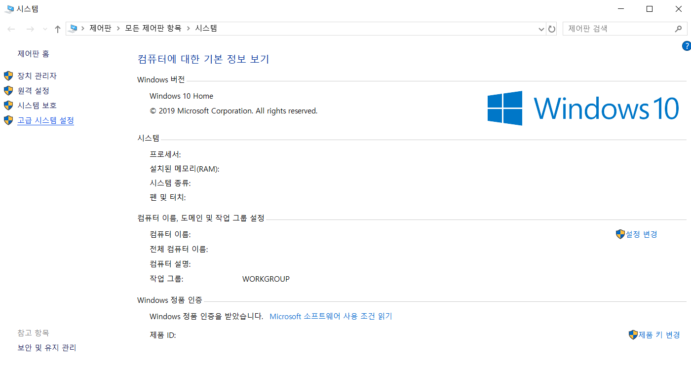
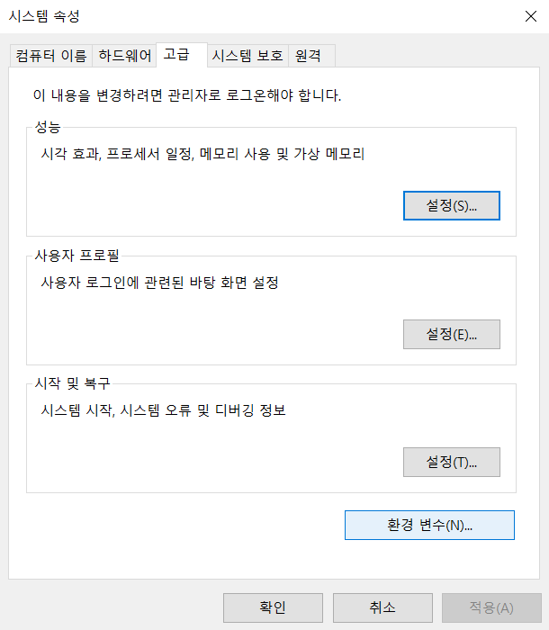
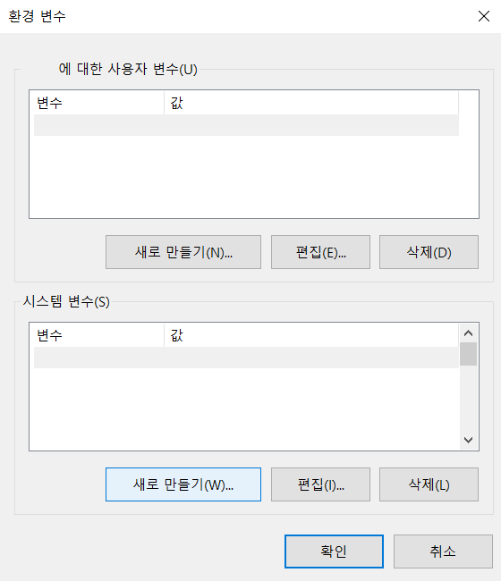
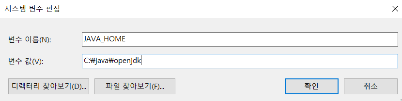
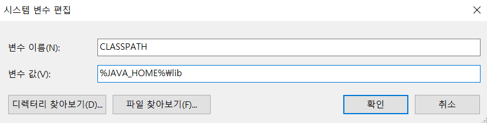
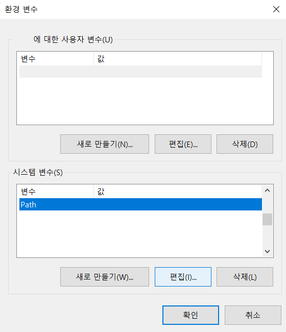
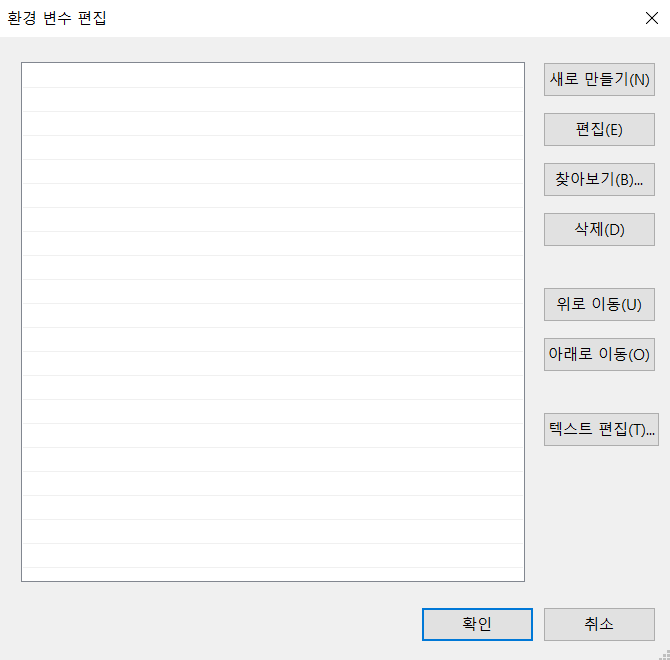
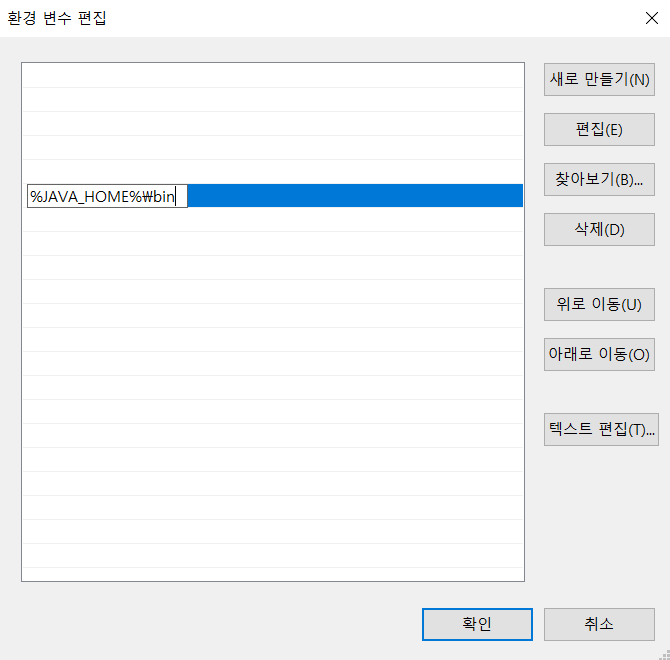

## Java installation
This project is developed by `Java`. 
For that reason, unfortunately, although we try to minimize set up, java must be installed in your computer. 
Although there is simple guide, java installation process may be different depending on your computer environment. 
Please google `install openjdk 8`. There are many detailed articles about the Java installation process.
This project does not receive Java installation inquiries beyond the prepared Guide document. 


### Window
1. Install JDK  
First of all you need to install jdk. 
You might be wondering that you heard you need to install java, but why you should install jdk instead.
Jdk is a abbreviation of `java development kit` which is necessary program for developing java application. 
It's okay to understand `jdk = java`. 
If you just want to using `Dluid` only, you can install jre (`java runtime environment`) instead of jdk.  
    - You can download jdk 11 at here. [Open jdk github](https://github.com/ojdkbuild/ojdkbuild)   
    - Or just download by this link. [Open jdk 11](https://github.com/ojdkbuild/ojdkbuild/releases/download/java-11-openjdk-11.0.7.10-1/java-11-openjdk-11.0.7.10-1.windows.ojdkbuild.x86_64.zip)
1. Unzip jdk file and move contents to directory `C:\java\openjdk` 
1. For example  
  
1. For changing system settings, Click the right mouse button at my computer icons and click the properties.   
  
1. Click the `Advanced system settings` button at left side.   
  
1. Click the environment variable button.  
  
1. Click the new environment variable button.   
  
1. Add `JAVA_HOME` variable as `C:\java\openjdk` (Path of openjdk we dowloaded).  
  
1. Add `CLASSPATH` variable as `%JAVA_HOME%\lib`.  
  
1. Edit system variable of `Path`.   
  
1. Click the new environment variable button.  
  
1. Add new environment variable `%JAVA_HOME%\bin`.  
  

### Mac
1. Install [Brew](https://brew.sh/)  
Brew is package manager for mac or linux. 
Brew helps installation of application much easier. 
```
/bin/bash -c "$(curl -fsSL https://raw.githubusercontent.com/Homebrew/install/master/install.sh)"

Paste above in a macOS terminal or linux shell prompt.
```
2. Add OpenJDK repository to brew.
```
brew tap AdoptOpenJDK/openjdk

Paste above in a macOS terminal or linux shell prompt.
```
3. Install OpenJDK 11
```
brew cask install adoptopenjdk11

Paste above in a macOS terminal or linux shell prompt.
```
4. Check open jdk is installed.
```
java -version

Paste above in a macOS terminal or linux shell prompt. 
If terminal print like `openjdk version` , java is installed successfully.
```