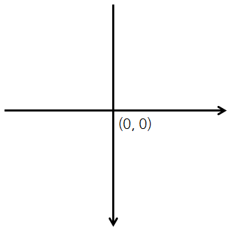
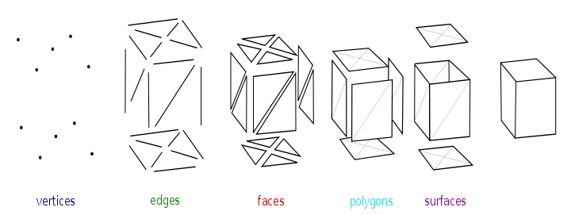

## Coordinate
Application frame and canvas use below coordinate. Generally we use y axis down to up. but is is upside down. Be warn about it. And z axis has front to back arrow.
  


## 3D polygon
### Point - Edge - Face - Polygon - Surface

[Image reference](https://en.wikipedia.org/wiki/Polygon_mesh)

```
private float[] meshPoints = {
        -5, 5, 0, // left down
        -5, -5, 0, // left up
        5, 5, 0, // right down
        5, -5, 0 // right up
};
public float[] textureCoords = {
        1, 1,
        1, 0,
        0, 1,
        0, 0
};
private int[] faces = {
        2, 2, 1, 1, 0, 0, // triangle #1
        2, 2, 3, 3, 1, 1  // triangle #2
};

mesh.getPoints().setAll(meshPoints);
mesh.getTexCoords().setAll(textureCoords);
mesh.getFaces().setAll(faces);
```

If you curious about texture mapping, you could get more information [here](https://kok202.tistory.com/180?category=803457).