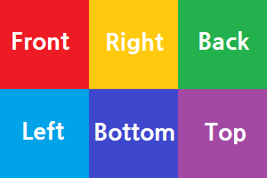
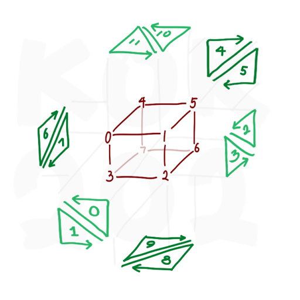
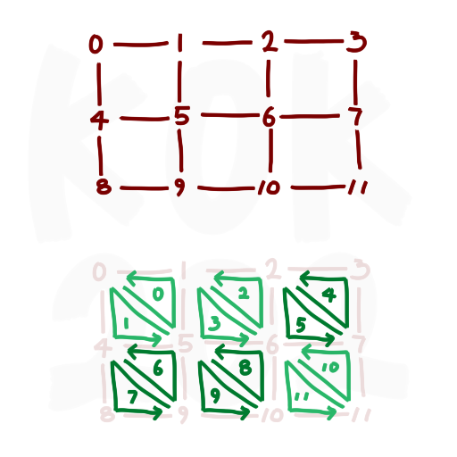
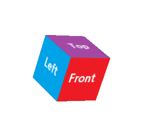

## Texture mapping

### Sample texture.  


### Sample code.
```java
public class Cube extends MeshView {
    private final float zero = 0;
    private final float aHalf = 1f / 2f;
    private final float aThird = 1f / 3f;
    private final float twoThirds = 2f / 3f;
    private final float one = 1;
    
    public Cube(int size, String texturePath){
        if(!StringUtil.isEmpty(textureSource)) {
            Image image = new Image(textureSource);
            DefaultMaterial defaultMaterial = new DefaultMaterial();
            defaultMaterial.setDiffuseMap(image);
            setMaterial(material);
        }

        float[] meshPoints = {
            -size, -size, -size, // left up front
            size, -size, -size, // right up front
            size, size, -size, // right down front
            -size, size, -size, // left down front
            -size, -size, size, // left up back
            size, -size, size, // right up back
            size, size, size, // right down back
            -size, size, size, // left down back
        };

        // [FRONT] [RIGHT] [ BACK ]
        // [LEFT ] [BOTTOM] [ TOP ]
        float[] textureCoords = {
                zero,      zero,
                aThird,    zero,
                twoThirds, zero,
                one,       zero,
                zero,      aHalf,
                aThird,    aHalf,
                twoThirds, aHalf,
                one,       aHalf,
                zero,      one,
                aThird,    one,
                twoThirds, one,
                one,       one,
        };

        // Set of ((meshPoint A, textureCoords A), (meshPoint B, textureCoords B), (meshPoint C, textureCoords C))
        int[] faces = {
            0, 0, 2, 5, 1, 1,
            2, 5, 0, 0, 3, 4,
            1, 1, 6, 6, 5, 2,
            6, 6, 1, 1, 2, 5,
            5, 2, 7, 7, 4, 3,
            7, 7, 5, 2, 6, 6,
            4, 4, 3, 9, 0, 5,
            3, 9, 4, 4, 7, 8,
            3, 5, 6, 10, 2, 6,
            6, 10, 3, 5, 7, 9,
            4, 6, 1, 11, 5, 7,
            1, 11, 4, 6, 0, 10,
        };

        TriangleMesh mesh = new TriangleMesh();
        mesh.getPoints().setAll(meshPoints);
        mesh.getTexCoords().setAll(textureCoords);
        mesh.getFaces().setAll(faces);
        setMesh(mesh);
    }
}
```

### Usage
```
String texturePath = getClass().getClassLoader().getResource("images/sample_texture.png").toString();
Cube cube = new Cube(2, texturePath);
sceneRoot.getChildren().add(cube);
```

Faces is set of ((meshPoint A, textureCoords A), (meshPoint B, textureCoords B), (meshPoint C, textureCoords C)).  
For example, first face is triainge which has points of meshPoint[0], meshPoint[2], meshPoint[1], and it's texture is mapped by specific range of image. (Range created by triangle textureCoords[0], textureCoords[5], textureCoords[1].)

  
Light green is clock wise. (CW)  
Dark green is counter clock wise. (CCW)  
Face culling
- https://learnopengl.com/Advanced-OpenGL/Face-Culling  
- https://stackoverflow.com/questions/20477137/why-should-i-create-vertices-counter-clockwise-and-not-clockwise  

  
Although dark green face has CW triangle in mesh points, it should be CCW in texture coords.
Think of it as the easiest 4th face. Imagine that image in the specified range actually stuck to the specified triangle.
Otherwise texture is flipped on every dark green face.

  
Result
