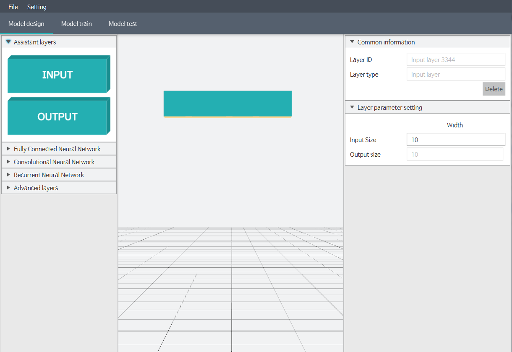

## XOR Problem (1. design model)
In this section, we are going to build, train and test AI model.
Our goal is create model that can solve `XOR` problem.
`XOR` problem is to create really simple gate which is one of logical gates.
`XOR` gate has two input, a and b that can be 0 or 1.
And if you push them into `XOR` gate, then it will emit the result like below.

|input a|input b|a xor b (output)|
|:---:|:---:|:---:|
|0|0|0|
|0|1|1|
|1|0|1|
|1|1|0| 

You may be disappointed that we are going to solve this simple problem.
But solving this problem in deep learning means a lot.
Nowadays software and hardware have been surprisingly advanced, so anyone can easily solve this problem.
But in the past, it was a vicious problem that had been leading downturn of deep learning.
For more information, google the keywords `deep learning xor problem`.

##### 1) Run the Dluid
Before the run the Application, Install the java first.
If you are using window, run the dluid.exe file.
Or not, using mac os, double click the dluid.jar file.

##### 2) Add input layer.
First of all, let's add input layer. 
drag `input box` at the left side and drop it into the center canvas. 

##### 3) Edit input layer.
`XOR` gate has two input. 
So we change size of input layer as 2.  

|input a|input b|
|:---:|:---:| 
|0|0|
|0|1|
|1|0|
|1|1|

##### 4) Add output layer.
And now we are going to add output layer.
We will modify all of the parameters at once later, so you don't mind about them.

##### 5) Add FCNN layer.
We will use two layers for this problem. 
So same as input and output layer, drag `FCNN box` at the left side and drop it into the center twice.

##### 6) Edit layers.
Edit parameters like below.
As you can see from the boxes in the center, when you make a model, the output size of the upper layer and the input size of the lower layer must be matched.

#### 7) Connect layers.
For make layers as one model, We need to connect them. 
Double click the upper layer, then it starts connection. 
If connection arrow is shown, choose lower layer. 
Repeat until all layers are connected as below. 

Then AI model is ready.