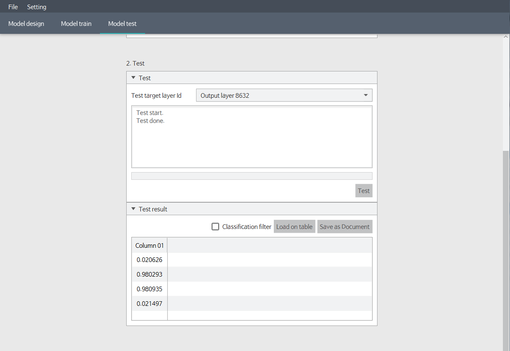

## XOR Problem (3. test model)

##### 1) Test tab.
Change to third tab (model test).

##### 2) Test data appearance.
Test data looks like below.

##### 3) Load test data.
As load train data. Click the browse button, and enter the parameter correctly.

##### 4) Check the loaded data completely.

##### 5) Test model.
Click the `Test` button.
If you see the message `"Test done"`, the test is complete.

##### 6) Compare the result.
Press `load on table` button, then you can see the result of model test. 
If it's close to the answer, it means model training was done successfully.

