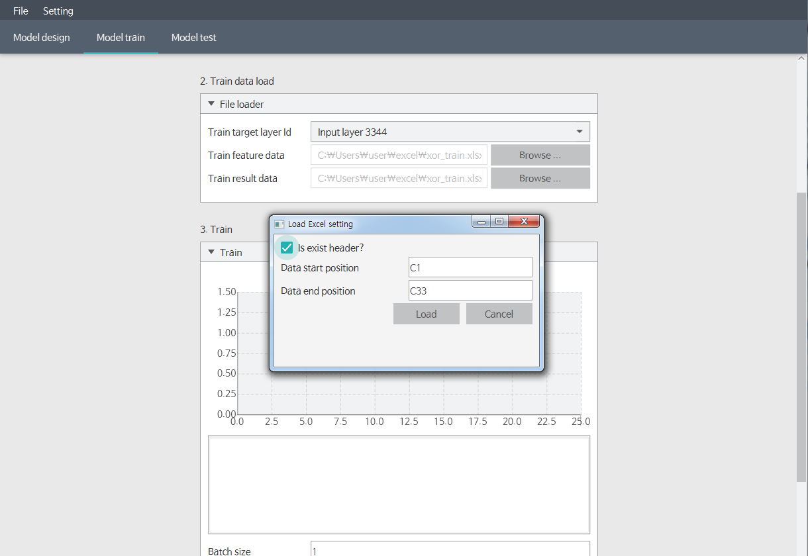

## XOR Problem (2. train model)

##### 1) Set model parameter.
Change to second tab (model train).
Then you will see the status window as below.
In this section, you can handle parameters about how to train model.
XOR problem is so simple that you don't need to handle all of them. 
Change only the initializer to `initialize as 0 to 1 distribution`.
And click the initialize button.

##### 2) initializer model.
Then disabled components will be activated like below.
Next step is load train data.

##### 3) Train data appearance.
Before load train data, Let's see what the train data looks like.
Although we can import csv and excel format, We'll use excel format, because it is more familiar.
There's nothing much to the data.
Actually it is repeat of `solution of xor problem` eight times.

##### 4) Load feature data.
We're going to load the feature data.
Feature Data refers to input data for the model.
In our data, the input area is corresponding to `A1` to `B33`.
Press the Browse button, and retrieve excel data.
And enter the start and end position of the feature data as shown below.
Do not forget check `is exist header?`, because header included in A1 to B33 area.

##### 5) Load result data.
Like the feature data, we're going to import result data.
The area of the result data is `C1` to `C33`, so enter it accordingly.
Same as well, check the `is exist header?`.

##### 6) Train the model.
Before the training.
In deep learning, It is also important to decide how to repeat learning.
Batch and epoch size has some meaning, but I think it is not appropriate to deal with here.
Enter as below, and press the `N time` button. 
It means repeat the training the model as epoch size times.
Then it starts training, and it will draw the graph converging to zero like that.
If graph is not converging to zero, then click the `N time` button one more, or initialize model and click the train button again.

